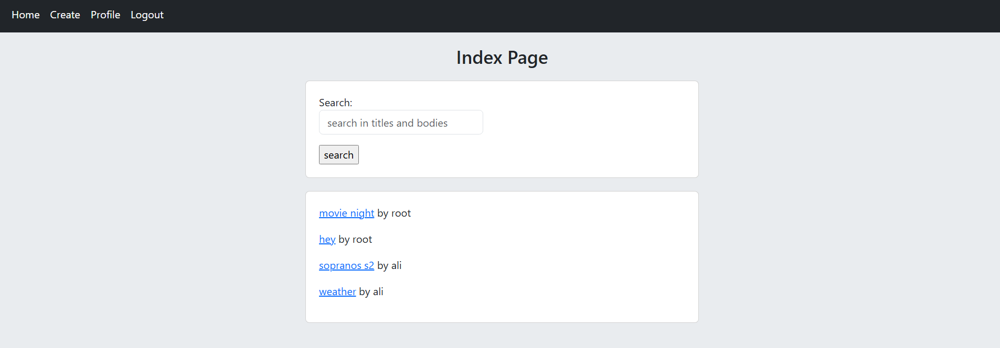

# Social Network with Django

### _Features_
+ user registeration, login (with username or email) and logout
+ check if username/email already exitst or not 
+ profile for each user with list of their posts
+ edit profile
+ customizing admin
+ list of posts on the homepage with links to their detail pages, ordered by updated time
+ create, update and delete posts 
+ add 404 error page 
+ reset password with email
+ follow and unfollow other users
+ write comments
+ like posts 
+ search into posts